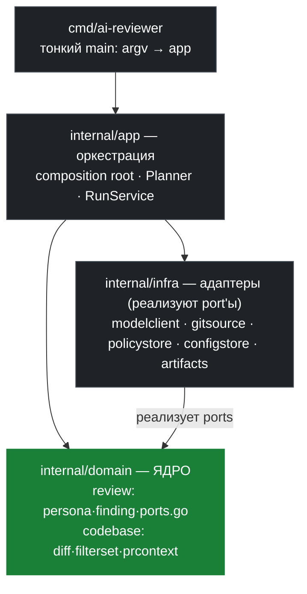

# ai-reviewer — Архитектура сквозь призму DDD

> Как функционирует `ai-reviewer` (gonka-ai), разобранный по слоям, контекстам и
> доменным понятиям Domain-Driven Design.

## Архитектурный обзор



> **Правило зависимостей:** всё направлено внутрь, к domain. Domain не знает ни об app, ни об infra.

## Код

Реальный `ModelClient` port из `internal/domain/review/review.go` — интерфейс, который domain объявляет, а infra реализует:

```go
// ModelClient is the port the domain uses to talk to any LLM provider.
// infra/modelclient adapters (OpenAI/Anthropic/Gemini) implement it.
type ModelClient interface {
    Generate(ctx context.Context, prompt string, maxTokens int) (ModelResult, error)
    GenerateJSON(ctx context.Context, prompt string, maxTokens int) (ModelResult, error)
}
```

`Finding` — чистый Value Object из `internal/domain/review/review.go`, без зависимостей на провайдеров:

```go
type Finding struct {
    Source       string  `json:"source"`
    File         string  `json:"file"`
    LineStart    *int    `json:"line_start,omitempty"`
    LineEnd      *int    `json:"line_end,omitempty"`
    Summary      string  `json:"summary"`
    Details      string  `json:"details,omitempty"`
    SeverityHint string  `json:"severity_hint"` // low | medium | high | critical | unknown
    Confidence   float64 `json:"confidence"`    // 0.0–1.0
}
```

`FilterSet` — Value Object из `internal/domain/codebase/codebase.go`, управляет релевантностью без LLM:

```go
type FilterSet struct {
    IncludeFilters    []string         `yaml:"path_filters"`
    ExcludeFilters    []string         `yaml:"exclude_filters"`
    GlobalExcludes    []string         `yaml:"-"`
    RegexFilters      []*regexp.Regexp `yaml:"-"`
    RawRegexFilters   []string         `yaml:"regex_filters"`
    BranchFilters     []string         `yaml:"branch_filters"`
    FunctionFilters   []string         `yaml:"function_filters"`
    LineNumberFilters []LineRange      `yaml:"line_numbers_filter"`
    DateFilter        string           `yaml:"date_filter"`
    IssueRegexes      []string         `yaml:"issue_regexes"`
    Any []FilterSet `yaml:"any,omitempty"`
    All []FilterSet `yaml:"all,omitempty"`
}
```
>
> Источник: свежий слой репозитория `github.com/gonka-ai/ai-reviewer`
> (последний коммит `038ecd4`, 2026-04-28), исходники в `./src`.
> Документ выведен из самого кода (`*.go`) и реальных артефактов (`.ai-review/**`),
> а не только из штатных `README.md` / `ARCHITECTURE.md`.

---

## 0. Краткая суть (TL;DR)

`ai-reviewer` — это **single-binary Go CLI**, который запускает ИИ-ревью кода над
GitHub PR / коммитом / диффом веток / набором файлов. Центральная ставка проекта
(из `VISION.md`):

> **Code review is not one job. It is an orchestration problem.**
> Ревью — это не одна задача, а задача оркестрации специализированных перспектив.

Вместо одного «универсального» промпта система разбивает ревью на множество узких
**персон** (persona), прогоняет их **многоступенчатым конвейером** и собирает
структурированный, аудируемый отчёт. Вся логика ревью (персоны, праймеры, вейверы)
живёт **рядом с кодом** в виде версионируемых Markdown-артефактов.

Три идеи, на которых держится всё остальное:

1. **Специализация** — узкая персона отвечает на один вопрос хорошо, а не «изображает
   старшего инженера».
2. **Repo-aware политика** — правила ревью версионируются вместе с кодом, который они
   проверяют (`.ai-review/<owner>/<repo>/...` + frontmatter `ai_review:`).
3. **Аудируемость и контроль стоимости** — каждый шаг пишет артефакты на диск; токены
   тратятся только там, где фильтры доказали релевантность.

---

## 1. Домен и единый язык (Ubiquitous Language)

DDD начинается с языка. Вот глоссарий `ai-reviewer` — это термины из кода, не выдуманные.
Они образуют единый язык всей системы.

| Термин | Тип в DDD | Где в коде | Смысл |
|---|---|---|---|
| **Run / Review Run** | Process / Aggregate Root | `RunConfig`, `RunResults` | Один прогон ревью над одной целью |
| **Run Target** | Value Object | `RunSettings.Command` (`pr`/`commit`/`branches`/`file`) | Что именно ревьюим |
| **PRInfo** | Entity | `context.go:17` | Разрешённый дескриптор цели (SHA, ветки, дата) |
| **PRContext / FileContext** | Aggregate / Entity | `context.go:29`, `:37` | «Ревьюируемый мир»: дифф, файлы, функции |
| **Persona** | Aggregate Root (домен ревью) | `persona.go:15` | Специализированная единица ревью |
| **Primer** | Entity | `primer.go:3` | Доменный контекст, инъектируемый в промпт по фильтру |
| **Concept** | Value Object | `context_concepts.go:19` | Семантический тег, связывающий праймеры |
| **Waiver** | Entity / Policy | `waiver.go:15` | Правило подавления находок (LLM-судья) |
| **Finding** | Value Object | `pipeline.go:11` | Атомарная нормализованная находка |
| **FilterSet** | Value Object | `context.go:44` | Декларативный предикат релевантности |
| **Model Category** | Value Object | `models.go:61` | Логическая категория модели (`balanced`, …) |
| **Model Profile** | Value Object | `config.go` | Маппинг категория → конкретная модель |
| **Explainer** | роль Persona | `persona.go` (`role: explainer`) | Персона-объяснитель (стадии `pre`/`post`) |
| **Reviewer** | роль Persona | `persona.go` (`role: reviewer`) | Персона-ревьюер (производит Findings) |
| **Run Artifact** | — | `.ai-review/.../runs/...` | Любой записанный на диск след прогона |

Принцип DDD здесь соблюдён буквально: **те же слова в YAML-артефактах, в Go-структурах,
в промптах и в отчёте**. `Finding.Source` ссылается на `Persona.ID`; вейвер дописывает
в `Finding.Details` строку `[Waived by <id>: <why>]` — язык не теряется между слоями.

---

## 2. Контекстная карта (Bounded Contexts)

Хотя физически код — это плоский Go-пакет `main`, по ответственности он чётко
распадается на **bounded contexts**. Это и есть рекомендуемая цель рефакторинга к DDD.

```
                      ┌─────────────────────────────────────────────┐
                      │              APPLICATION / ORCHESTRATION      │
                      │   main.go  ·  settings.go (NewRunConfig)      │
                      │   — composition root, порядок стадий          │
                      └───────────────┬─────────────────────────────┘
            планирует прогон          │ дирижирует
        ┌─────────────────────────────┼──────────────────────────────┐
        ▼                             ▼                                ▼
┌────────────────┐        ┌─────────────────────────┐       ┌────────────────────┐
│  REVIEW POLICY │        │     REVIEW DOMAIN       │       │   CODE CONTEXT     │
│   (артефакты)  │        │  (ядро доменной логики) │       │  (ревьюируемый мир)│
│ scanner.go     │ корми- │ persona.go  pipeline.go │ берёт │ context.go  git.go │
│ config.go      │ т ───▶ │ primer.go   waiver.go   │ ◀──── │ PRInfo/PRContext   │
│ Persona/Primer │        │ Finding · normalize ·   │ контекст FileContext       │
│ /Waiver/Config │        │ aggregate · waive       │       │ FilterSet · diff   │
└────────────────┘        └───────────┬─────────────┘       └────────────────────┘
                                      │ вызывает
                                      ▼
                          ┌─────────────────────────────┐
                          │   MODEL ACCESS (ACL)        │
                          │   models.go                 │
                          │   ModelClient интерфейс ·   │
                          │   OpenAI / Anthropic /Gemini│
                          └─────────────────────────────┘
```

### 2.1. Review Domain (ядро)
Сердце системы: что такое находка, как персона исполняется, как находки нормализуются,
вейвятся и агрегируются. Файлы: `persona.go`, `pipeline.go`, `primer.go`, `waiver.go`,
`context_concepts.go`, `context_primers.go`.

### 2.2. Code Context (ревьюируемый мир)
Строит из git/GitHub неизменяемое представление изменений: `PRInfo` → `PRContext` →
`[]FileContext`. Здесь же — модель фильтрации (`FilterSet`) и аннотация диффа.
Файлы: `context.go`, `git.go`.

### 2.3. Review Policy (политика как артефакты)
Обнаружение и загрузка персон/праймеров/вейверов/конфига из репозитория и локальных
директорий. Файлы: `scanner.go`, `config.go`.

### 2.4. Model Access (Anti-Corruption Layer)
Унифицирует трёх провайдеров (OpenAI / Anthropic / Gemini) за одним интерфейсом
`ModelClient`. Это **ACL** в терминах DDD: домен не знает о провайдерах. Файл: `models.go`.

### 2.5. Application / Orchestration
Слой приложения: парсинг CLI, планирование прогона (composition root `NewRunConfig`),
порядок стадий конвейера, конкурентность, отчётность. Файлы: `main.go`, `settings.go`.

---

## 3. Доменные модели по слоям

### 3.1. Code Context: «ревьюируемый мир»

**`PRInfo`** (`context.go:17`) — Entity, разрешённый дескриптор цели:

```go
type PRInfo struct {
    Title, Body                  string
    BaseRefName, BaseRefOid      string  // база (SHA)
    HeadRefName, HeadRefOid      string  // голова (SHA)
    IsCommit                     bool    // режим одиночного коммита
    CommitDate                   time.Time
    FilePatterns                 []string
}
```

Хитрость: **режим цели кодируется комбинацией полей**, а не enum-ом.
`IsCommit=true` → коммит против родителя; `BaseRefOid == HeadRefOid && !IsCommit` →
**file-mode** (файлы показываются как «полностью добавленные»).

**`FileContext`** (`context.go:37`) — Entity единицы ревью:

```go
type FileContext struct {
    Filename     string   // "src/main.go"
    Diff         string   // аннотированный дифф: "LINE_NO:±content"
    ChangedLines []string // содержимое ±-строк (без номеров)
    Functions    []string // эвристически извлечённые имена функций
}
```

**Идея №1 — аннотированный дифф.** `AnnotateDiff()` (`context.go:746`) переписывает
unified diff в формат `НОМЕР_СТРОКИ:±содержимое`, ведя счётчик строк через все ханки
(`+` увеличивает счётчик, `-` нет, контекст ` ` увеличивает). Это даёт LLM точные номера
строк без галлюцинаций и позволяет потом фильтровать по диапазонам строк.

**Идея №2 — эвристическое извлечение функций** одним языко-нейтральным регэкспом
(`context.go:751`):
```go
`(?:func|function|class|def|method|type)\s+([a-zA-Z_][a-zA-Z0-9_]*)`
```
применяется только к добавленным строкам. Грубо, но дёшево — и питает `function_filters`.

**Идея №3 — file-mode как фейковый дифф.** Чтобы ревьюить целые файлы, система
**фабрикует дифф** `@@ -0,0 +1,N @@` со всеми строками как добавленными (`context.go:554`).
Один и тот же код-путь работает и для диффов, и для целых файлов.

---

### 3.2. FilterSet — Value Object управления стоимостью

`FilterSet` (`context.go:44`) — самый важный для экономики Value Object. Это декларативный
предикат «релевантен ли этот файл/находка данной персоне/праймеру/вейверу».

```go
type FilterSet struct {
    IncludeFilters    []string         // gitignore-стиль
    ExcludeFilters    []string
    GlobalExcludes    []string         // из Config, если не перекрыто Include
    RegexFilters      []*regexp.Regexp // по содержимому изменённых строк
    BranchFilters     []string
    FunctionFilters   []string         // точное совпадение имён функций
    LineNumberFilters []LineRange      // диапазоны строк (включительно)
    DateFilter        string           // "2006-01-02": коммиты строго до даты
    IssueRegexes      []string         // по тексту находки (post-LLM)
    Any  []FilterSet                   // OR-композиция
    All  []FilterSet                   // AND-композиция
}
```

**Идея №4 — двухслойная фильтрация для экономии токенов.** `Matches()` (`context.go:85`)
исполняет фильтры в порядке от дешёвых к дорогим с короткими замыканиями:
`Any/All` → путь → ветка → функция → дата → диапазон строк → регэксп находки → регэксп
содержимого. **Файл отбрасывается раньше, чем его дифф попадёт в промпт.** Самый сильный
рычаг — исключение путей до выборки диффа + регэксп по содержимому: убирает ~95% объёма
без единого обращения к LLM.

**Идея №5 — рекурсивная композиция (`Any`/`All`)** даёт вложенную булеву логику фильтров —
по сути, маленький DSL предикатов, выраженный данными, а не кодом.

**Идея №6 — глобальные исключения с override.** `global_excludes` (lock-файлы, `go.sum`,
сгенерированный код) выкидываются всегда, **кроме** случаев явного включения через
`IncludeFilters` (`context.go:662`). Свежий коммит `038ecd4` как раз добавил
глобальное исключение `config.yaml` — чтобы такие файлы не «съедали токены».

---

### 3.3. Review Domain: Persona — корень агрегата ревью

**`Persona`** (`persona.go:15`) — главная исполняемая единица. YAML-frontmatter + свободные
инструкции в Markdown.

```go
type Persona struct {
    ID                string
    ModelCategory     string    // логическая категория модели
    MaxTokens         *int      // указатель → различает «не задано» (nil) и 0
    Filters           FilterSet // inline во frontmatter
    Role              string    // "reviewer" (по умолч.) | "explainer"
    Stage             string    // "pre" | "post" (для explainer)
    IncludeFindings   bool      // подмешать находки предыдущих персон
    IncludeExplainers []string  // подмешать вывод конкретных pre-explainer'ов
    ExcludeDiff       bool      // в промпт идёт только статистика
    Instructions      string    // тело Markdown
}
```

**Таксономия ролей × стадий** — это, по сути, конечный автомат поведения персоны:

| Role | Stage | Когда исполняется | Вывод | Особенность |
|---|---|---|---|---|
| `explainer` | `pre` | до ревьюеров | строгий JSON (`{files:[{file,analysis}]}`) | **кэшируется** по SHA |
| `reviewer` | — | основная стадия | свободный текст → нормализация | производит `Finding` |
| `explainer` | `post` | после агрегации | свободный Markdown | попадает в финальный отчёт |

Пример реальной персоны (`ai-reviewer-philosophy.md`) — самоприменение инструмента:
```yaml
id: ai-reviewer-philosophy
model_category: balanced
path_filters: ["*.go", ".ai-review/gonka-ai/ai-reviewer/**", "README.md", "ARCHITECTURE.md"]
---
You are the product philosophy reviewer for ai-reviewer.
Check whether changes align with the tool's intended character:
- low surprise and high operator trust
- repo-scoped configuration rather than spooky global behavior ...
```
Персона проверяет не баги, а **соответствие философии продукта** — это ярко показывает,
что «персона» — это единица *намерения*, а не линтер.

**Идея №7 — каскад лимита токенов через указатели.** `*int` позволяет различить «не задано»
(`nil`) от «явный 0 = без лимита». Приоритет (`persona.go:104`):
CLI `--max-tokens` ▸ persona ▸ model config. `max_tokens_test.go` фиксирует все четыре случая.

**Идея №8 — кэш pre-explainer'ов по содержимому.** Ключ кэша = `SHA256(instructions + headSHA)`
(`persona.go:78`). Один и тот же объяснитель на одном коммите не вызывает LLM повторно.
Кэшируются только **детерминированные** артефакты (pre, привязанные к неизменному SHA) —
ревьюеры и post-объяснители никогда не кэшируются.

---

### 3.4. Finding — Value Object результата

**`Finding`** (`pipeline.go:11`) — атом результата ревью:

```go
type Finding struct {
    Source       string  // ID персоны-автора (атрибуция!)
    File         string
    LineStart    *int
    LineEnd      *int
    Summary      string
    Details      string
    SeverityHint string  // low | medium | high | critical | unknown
    Confidence   float64 // 0.0–1.0
}
```

**Идея №9 — «сырой текст → нормализация» отдельным дешёвым шагом.** Ревьюер пишет
*свободный текст*, и только потом **отдельная (более дешёвая) модель** нормализует его в
строгий JSON (`NormalizePersonaOutput`, `pipeline.go:186`). Системный промпт нормализатора
(`pipeline.go:55`) жёстко запрещает: выдумывать находки, заново анализировать код, **угадывать
номера строк**. Это разделяет «творческую» часть (поиск) и «дисциплинированную» (структуризация)
— разные задачи, разные модели. Извлечение JSON устойчиво к ```-ограждениям (`extractJSON`,
`pipeline.go:171`), а сбой парсинга трактуется как «ноль находок», а не падение.

---

### 3.5. Primer и Concept — инъекция доменного знания

**`Primer`** (`primer.go:3`) — кусок доменного контекста, который **подмешивается в промпт
персоны, только когда его фильтр совпал** с ревьюируемыми файлами.

```go
type Primer struct {
    ID, Type          string
    Filters           FilterSet
    AuthoringConcepts []string  // семантические теги
    Content           string    // Markdown, инъектируемый в промпт
}
```

Пример (`gonka/primers/inference-chain.md`) объясняет модели, что такое блокчейн Gonka,
PoC, как регистрируются инференсы — то, чего нет в диффе, но без чего ревью слепо.

**Идея №10 — Concepts как семантический слой поверх путей.** `matchPrimerForContext`
(`context_primers.go:86`) требует **И** совпадения фильтра, **И** пересечения концептов
(если они объявлены). Concepts (`context_concepts.go`) позволяют связывать праймеры не только
по путям файлов, но и по смыслу запланированного изменения — отдельные подкоманды
`context`/`concepts` дают это наружу для интеграций.

---

### 3.6. Waiver — политика подавления как LLM-судья

**`Waiver`** (`waiver.go:15`) — структурированное правило подавления находок. Это **Policy**
в DDD: декларация «этот класс проблем здесь намеренно допустим».

```go
type Waiver struct {
    ID, ModelCategory string
    Filters           FilterSet
    Instructions      string  // обоснование «почему игнорируем»
}
```

**Идея №11 — двухфазное подавление: фильтр + LLM-судья.** `ApplyWaivers` (`waiver.go:54`):
1. **Фаза 1 (дёшево, детерминированно):** локационная фильтрация. Находка должна попасть
   в файл/ветку вейвера, а её диапазон строк — **полностью содержаться** в диапазоне вейвера
   (`findingStart >= r.Start && findingEnd <= r.End`, `waiver.go:107`).
2. **Фаза 2 (дорого, нюансировано):** LLM получает дифф, контекст находки и текст вейвера и
   возвращает `{applies, certainty, why}` (`WaiverEvaluation`, `waiver.go:28`). Это избегает
   хрупкости чистого регэкспа — судить «применим ли вейвер» доверено модели.

Подавленная находка не удаляется бесследно: она переносится в `WaivedFindings` и её
`Details` дописывается строкой `[Waived by <id>: <why>]` — **аудиторский след сохраняется**.
Пример (`gonka/waivers/default_params.md`): «Дефолтные параметры могут использовать
`DecimalFromFloat` без риска консенсуса, т.к. это только для тестов».

---

## 4. Доменный процесс: многоступенчатый конвейер

Это главный архитектурный выбор. Стадии **упорядочены** (зависимости по данным), но
**внутри стадии персоны исполняются конкурентно** (`main.go:144`, семафор на
`Concurrency`, по умолчанию 5).

```
   ①                ②               ③            ④            ⑤             ⑥           ⑦
 pre-        ─▶  reviewers    ─▶ normalize  ─▶ waivers   ─▶ aggregate  ─▶  post-    ─▶ report
 explainers      (concurrent)    (cheap LLM)   (LLM-judge)   (balanced)     explainers
   │ JSON           │ raw text      │ Finding[]   │ убирает      │ Markdown      │ Markdown   │ stdout +
   │ (кэш по SHA)   │               │             │ waived       │ summary       │            │ артефакты
   ▼                ▼               ▼             ▼              ▼               ▼            ▼
 PreRunAnalyses  raw.md         findings.json  WaivedFindings  summary.md   PostRunOutputs  report.md
 (map file→текст)                                                                           run-log.jsonl
```

Поток данных между стадиями (через `RunResults`, защищённый мьютексами):

1. **Pre-explainers → Reviewers**: `RunResults.PreRunAnalyses` (`map[file][]analysis`)
   подмешивается в промпты ревьюеров (выборочно через `IncludeExplainers`).
2. **Reviewers → Normalize → Aggregate**: сырой текст → `[]Finding` → `AllFindings`.
3. **Aggregate** (`AggregateFindings`, `pipeline.go:216`): одна модель (`balanced`, с фолбэком
   на `best_code`) дедуплицирует, кластеризует, назначает презентационную severity, **сохраняет
   атрибуцию персон** (`@persona{ID}`) и пишет финальный Markdown по секциям
   *Must Fix / Major / Review Carefully / Consider / Persona Summaries*.

**Идея №12 — стадии разной «дороговизны модели».** Поиск делает категория уровня персоны;
нормализация — дешёвая модель; вейверы — обычно `fastest_good`; агрегация — `balanced`.
Токены тратятся пропорционально ценности шага (`VISION.md`: «spend tokens where they create
the most review value»).

**Идея №13 — устойчивость к сбоям.** Падение одной персоны логируется, но **не останавливает
конвейер** (`main.go:156`); ошибка агрегации даёт дефолтный summary. Цель — всегда выдать
полезный отчёт.

---

## 5. Application Layer: composition root и планирование

**`NewRunConfig`** (`settings.go:345`) — **composition root** (термин из DDD/чистой архитектуры):
единственное место, где собираются все зависимости. Семь фаз:

1. Настройка вывода (`OutputHandler`, `RunDir` по таймстампу).
2. Разрешение цели → `PRInfo` (ветвление `pr`/`commit`/`branches`/`file`; `EnsureRepo`,
   `FetchRefs`, `git.go`).
3. Накопление `SearchPaths` (ExeDir, InitialCwd, cwd; дедуп с сохранением порядка).
4. Загрузка `Config` + персон/праймеров/вейверов; резолв профиля моделей (фолбэк-цепочка).
5. Извлечение глобального `PRContext` (дифф + затронутые файлы).
6. **Фильтрация персон** в шесть групп: `{Pre,Reviewers,Post}{ToRun,ToSkip}` — каждая
   персона получает *суженный* `PRContext` только из релевантных ей файлов.
7. Инициализация клиентов моделей (двухуровневая: `BalancedClient` + `FastestClient`);
   при `--dry-run` шаг пропускается.

**Идея №14 — `RunSettings` как явная Run Target Spec.** Подкоманды `pr`/`commit`/`branches`/
`file` + `context`/`concepts`. Парсер допускает **interspersed-флаги** (флаги до/после
позиционных аргументов — `settings.go:1001`), что нетипично для стандартного `flag` Go.

**Идея №15 — режимы наблюдаемости без затрат.** `--dry-run` (только скан),
`--context-eval` (посчитать размеры контекста/токены, в т.ч. CSV), `--prompt-only`
(построить промпты и остановиться) — позволяют отлаживать и оценивать стоимость **до**
траты денег на модели.

---

## 6. Review Policy: артефакты как версионируемая политика

**Идея №16 — трёхслойное обнаружение артефактов с приоритетом** (`scanner.go:39`):

1. **Закоммиченный Markdown на head-SHA** (источник истины, распространяется с репо):
   `git ls-tree` + `git show <SHA>:<file>`; учитываются только выделенные директории
   `.ai-review/<repo>/<type>s/` или файлы с frontmatter `ai_review:`.
2. **Локальные repo-scoped директории** (`.ai-review/<owner>/<repo>/personas|primers|waivers`):
   машинные/CI-оверрайды.
3. **Свободные файлы в search paths** (требуют тега `ai_review:`): ad-hoc определения.

**Дедуп по ID**: первый источник побеждает (`scanner.go:66`). Это реализует
**precedence-семантику** «закоммиченное в репо > локальное > свободное».

**Идея №17 — двухшаговый парсинг frontmatter.** Сначала дешёвый байтовый скан на `ai_review:`,
и только при попадании — дорогой YAML-парсинг (`scanner.go:188`). ~99% `.md`-файлов
отсеиваются до парсинга. ID при отсутствии — имя файла без расширения.

**Config и Model Profiles** (`config.go`, реальный `config.yaml`): `model_definitions`
(переиспользуемые описания моделей с ценами) + `model_profiles` (профиль → категория → модель).
Персоны ссылаются на **категории** (`balanced`, `best_code`, `frontier_best`, `fastest_good`,
`cheap`), а профиль (`anthropic` / `gemini_standard` / `openai` / …) подменяет конкретные модели
целиком. Это **позднее связывание модели**: сменить весь стек моделей = сменить один флаг
`--model-profile`. `global_instructions` добавляют общие правила во все промпты
(«A correct report with no findings is better than a noisy one»).

---

## 7. Model Access как Anti-Corruption Layer

**`ModelClient`** (`models.go:46`) — узкий интерфейс, изолирующий домен от провайдеров:

```go
type ModelClient interface {
    Generate(ctx, prompt string, maxTokens int) (ModelResult, error)      // свободный текст
    GenerateJSON(ctx, prompt string, maxTokens int) (ModelResult, error)  // строгий JSON
}
```

`ModelResult` несёт `Text` + учёт токенов (`TokensIn/Out/Reasoning`) + `FinishReason`.
Фабрика `GetModelClient` (`models.go:360`) выбирает реализацию по строке провайдера; ключи
читаются из `KEYS.env`, затем из окружения.

**Идея №18 — нормализация «reasoning/thinking» поверх разных API.** Категория несёт
`reasoning_level` (`none/low/medium/high`), а ACL транслирует его в провайдер-специфику:
OpenAI `ReasoningEffort`; Anthropic — расчёт **thinking budget** (мин. 1024, до половины
`max_tokens`, с авто-расширением `max_tokens`, т.к. он обязан быть больше бюджета,
`models.go:192`); Gemini `ThinkingLevel`. Домен про это ничего не знает.

**Идея №19 — стоимость как first-class понятие.** Цена считается прямо из учёта токенов:
`(in·in_price + (out+reasoning)·out_price)/1e6` (`main.go:341`). Reasoning-токены тарифицируются
по выходной цене. Итог агрегируется по моделям и пишется в отчёт и `run-log.jsonl`.

---

## 8. Observability: артефакты прогона

**Идея №20 — artifact-first.** Каждый прогон пишет timestamp-директорию
`.ai-review/<repo>/runs/<target>/<YYYY-MM-DD_HH-MM-SS>/` с:

- `summary.md`, `report.md`, `all_findings.json`, `agent_handoff.md`
- по каждой персоне: `prompt.md`, `raw.md`, `findings.json`/`parsed.json`
- `stats.txt` (токены, тайминги, стоимость)
- кумулятивный `run-log.jsonl` (одна JSON-строка на персону: модель, токены, время, цена,
  finish_reason, праймеры, находки)

Это даёт **paper trail**: если ревью странное, дорогое или неверное — есть полный след без
повторного прогона. `OutputHandler` ещё и связывает маркеры `@persona{ID}` в кликабельные
ссылки на `raw.md` персоны.

---

## 9. Карта «файл → DDD-роль» (для мейнтейнера)

| Файл | Bounded Context | Роль в DDD |
|---|---|---|
| `main.go` | Application | оркестрация стадий, конкурентность, отчёт |
| `settings.go` | Application | CLI-парсинг, `NewRunConfig` (composition root), `RunResults` |
| `config.go` | Review Policy | загрузка/слияние конфига, профили моделей |
| `scanner.go` | Review Policy | обнаружение артефактов, дедуп, frontmatter |
| `context.go` | Code Context | `PRInfo`/`PRContext`/`FileContext`, `FilterSet`, дифф, промпт |
| `git.go` | Code Context (Infra) | получение репо, fetch refs |
| `persona.go` | Review Domain | модель и исполнение персоны, нормализация |
| `primer.go` | Review Domain | модель и матчинг праймеров |
| `waiver.go` | Review Domain | модель и LLM-оценка вейверов |
| `context_concepts.go` / `context_primers.go` | Review Domain | концепты, матчинг под planned-context |
| `pipeline.go` | Review Domain | `Finding`, нормализация, агрегация, системные промпты |
| `models.go` | Model Access (ACL) | интерфейс `ModelClient`, провайдеры |

---

## 10. Сильные и слабые стороны (по DDD)

**Сильные стороны.**
- Чёткий единый язык, согласованный от YAML до промптов и отчёта.
- Domain-процесс (конвейер) явный и легко рассуждаемый; стадии разделены по ответственности.
- Политика как версионируемые артефакты рядом с кодом — настоящая repo-aware модель.
- ACL над провайдерами держит домен чистым от API-специфики.
- Аудируемость встроена в архитектуру, а не прикручена.

**Слабые стороны (долг к идеалу DDD).**
- Физически — плоский пакет `main`: bounded contexts не разнесены по пакетам/модулям.
- `NewRunConfig` совмещает **wiring зависимостей** и **бизнес-оркестрацию** (god-method).
- Жизненный цикл клиентов моделей частично централизован: нормализация/агрегация шарят
  клиентов, а персоны/вейверы создают клиентов на лету.
- Многие инварианты держатся **промптами**, а не структурно (типично для LLM-систем, но
  повышает цену хороших артефактов и тестов).

---

## 11. Главные идеи, которые стоит «утащить» (sumмари инсайтов)

Если коротко — что в `ai-reviewer` действительно умно и переносимо:

1. **Ревью = оркестрация**, а не один промпт. Узкие персоны → выше сигнал.
2. **Аннотированный дифф** `НОМЕР:±строка` — точные строки без галлюцинаций.
3. **File-mode через фейковый дифф** — один код-путь для диффов и целых файлов.
4. **Двухслойная фильтрация** (`FilterSet`) — отбрасывай файлы до LLM; самый сильный рычаг цены.
5. **Композитные фильтры `Any`/`All`** — булев DSL предикатов данными.
6. **`global_excludes` с override** — не жги токены на lock/generated/`go.sum`/`config.yaml`.
7. **Каскад `*int` лимита токенов** — `nil` ≠ `0` (не задано vs «без лимита»).
8. **Кэш pre-explainer'ов по `SHA256(instructions+headSHA)`** — кэшируй только детерминированное.
9. **Сырой текст → отдельная дешёвая нормализация в JSON** — раздели поиск и структуризацию.
10. **Concepts** — семантический матчинг праймеров поверх путей.
11. **Вейвер = фильтр + LLM-судья**, плюс сохранение `[Waived by ...]` в аудит.
12. **Стадии с разной «дороговизной модели»** — токены по ценности шага.
13. **Устойчивость к сбоям** — отчёт выдаётся всегда.
14. **`RunSettings` как явная Target Spec** + interspersed-флаги.
15. **`--dry-run` / `--context-eval` / `--prompt-only`** — наблюдаемость без затрат.
16. **Трёхслойное обнаружение артефактов с приоритетом** committed > local > loose.
17. **Двухшаговый парсинг frontmatter** — байтовый скан до YAML.
18. **`reasoning_level` нормализован** поверх OpenAI/Anthropic/Gemini в ACL.
19. **Стоимость — first-class**, считается из токенов, агрегируется по моделям.
20. **Artifact-first observability** — полный paper trail каждого прогона.

---

*Документ описывает текущий слой `ai-reviewer` (`038ecd4`). Это выведенная DDD-модель
системы, а не предложенный рефакторинг — раздел 10 отмечает разрыв между фактической
плоской компоновкой и идеальным разнесением bounded contexts.*
