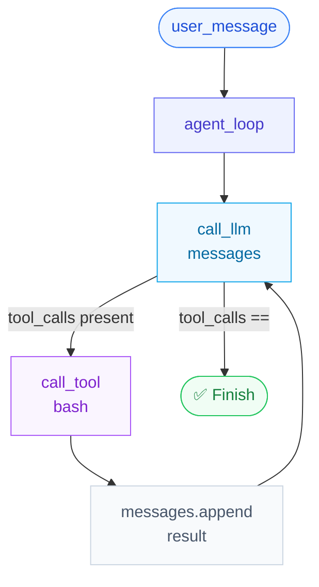
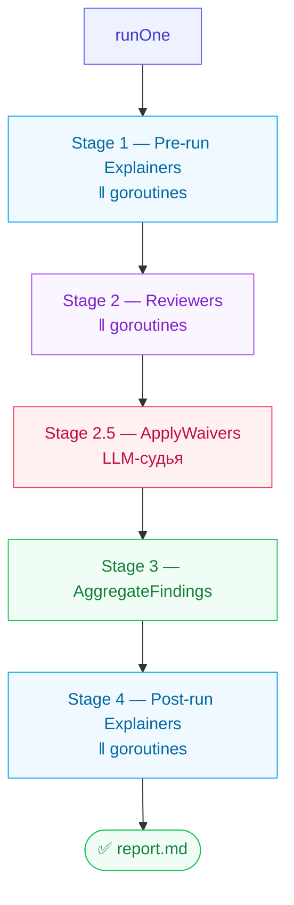

# Agent Loop vs Pipeline — сравнение топологий

> **Суть:** есть два фундаментальных способа оркестровать LLM-вызовы — **цикл**
> (agent loop) и **граф** (directed pipeline). chebupelka — первый, ai-reviewer — второй.
> Выбор топологии диктуется тем, известна ли структура задачи заранее.

---

## Архитектурный обзор

### chebupelka — Agent Loop



**Ключевые свойства:**
- Число итераций неизвестно заранее — модель сама решает когда остановиться
- Результат каждого инструмента попадает в `messages` и влияет на следующий шаг
- Backstop: `MAX_TURNS = 1000` защищает от бесконечного цикла

---

### ai-reviewer — Directed Pipeline (DAG)



**Ключевые свойства:**
- Каждая персона вызывает LLM ровно 1 раз — нет обратной связи между вызовами
- Параллелизм горутинами внутри стадий, но стадии строго последовательны
- Граф ацикличен (DAG) — нет петель, нет условных переходов между стадиями

---

## Разбор кода: где в ai-reviewer «живёт» оркестрация

### runOne() — главный оркестратор

```go
// main.go:63
func runOne(ctx context.Context, runConfig *RunConfig, s *RunSettings) {
    runResults := NewRunResults()

    sem := make(chan struct{}, s.Concurrency) // семафор параллелизма

    runPersonas(ctx, runConfig.PreRunToRun,    rc, rr, sem, "pre-run explainers") // Stage 1
    runPersonas(ctx, runConfig.ReviewersToRun, rc, rr, sem, "reviewers")          // Stage 2
    ApplyWaivers(ctx, runConfig, runResults)                                       // Stage 2.5
    AggregateFindings(ctx, rc.BalancedClient, runResults.AllFindings)             // Stage 3
    runPersonas(ctx, runConfig.PostRunToRun,   rc, rr, sem, "post-run explainers") // Stage 4
    generateReport(...)                                                            // Report
}
```

`runOne()` — линейная последовательность вызовов. Это и есть весь "цикл" — но он не цикл.

### runPersonas() — параллельный Fan-out внутри стадии

```go
// main.go:144
func runPersonas(ctx context.Context, personas []PersonaRun, ...) {
    var wg sync.WaitGroup
    for _, run := range personas {
        wg.Add(1)
        go func(run PersonaRun) {
            defer wg.Done()
            sem <- struct{}{}        // захват слота (ограничение параллелизма)
            defer func() { <-sem }()
            run.Execute(ctx, rc, rr)
        }(run)
    }
    wg.Wait()   // барьер: все персоны стадии завершились → переходим к следующей
}
```

Это горутинный fan-out с семафором. Все персоны одной стадии запускаются параллельно,
затем `wg.Wait()` — барьер перед следующей стадией.

---

## Сравнительная таблица

| Критерий | chebupelka (loop) | ai-reviewer (pipeline) |
|---|---|---|
| **Топология** | цикл (feedback loop) | DAG (без циклов) |
| **Структура задачи** | неизвестна заранее | фиксирована (ревью кода) |
| **Число LLM-вызовов** | N × (неизвестно) | N × персон (известно) |
| **Обратная связь** | да — результат → следующий prompt | нет — персоны независимы |
| **Параллелизм** | нет (1 агент) | горутины внутри стадий |
| **Стоп-условие** | отсутствие tool_calls | конец последней стадии |
| **Стоимость** | непредсказуема | детерминирована (RunPlan) |
| **Отказоустойчивость** | падает вся цепочка | skip + continue |

---

## Почему ai-reviewer выбрал DAG, а не loop

**Задача ревью кода структурирована.** Мы знаем:
1. какие файлы изменились (до запуска)
2. какие персоны нужны (конфиг)
3. какой порядок стадий обязателен (pre → review → waiver → aggregate → post)

Когда задача структурирована — loop избыточен: он добавляет непредсказуемость
стоимости и число вызовов, но не даёт выигрыша.

**Loop нужен, когда задача открытая:** «напиши скрипт», «отладь этот баг» —
количество шагов непредсказуемо, инструмент `bash` нужен на каждом шаге.

> **Правило выбора:** знаешь граф задачи → DAG pipeline. Не знаешь → agent loop.

---

## Единое ядро: одиночный LLM-вызов

Несмотря на разную топологию, **нижний уровень идентичен** — один HTTP-запрос к LLM:

```python
# chebupelka
def call_llm(messages):
    resp = requests.post(f"{LLM_BASE_URL}/chat/completions", json={
        "messages": messages, "tools": LLM_TOOLS, "tool_choice": "auto"
    })
    return content, tool_calls
```

```go
// ai-reviewer (Persona.Run → client.Generate)
result, err = client.Generate(personaCtx, prompt, maxTokens)
```

Разница только в том, что chebupelka передаёт `tools` и ожидает `tool_calls`,
а ai-reviewer ожидает текстовый ответ (или JSON через `GenerateJSON`).

---

## Связи
- Хаб: [[MOC — ai-reviewer]]
- Подробно о персоне как единице вызова: [[Persona — корень агрегата ревью]]
- Конвейер ai-reviewer пошагово: [[Sequence — конвейер ревью]]
- Исходник loop-паттерна: [[chebupelka — минимальный coding agent]]
- Агрегация как отдельный LLM-шаг: [[Finding — Value Object находки]]
