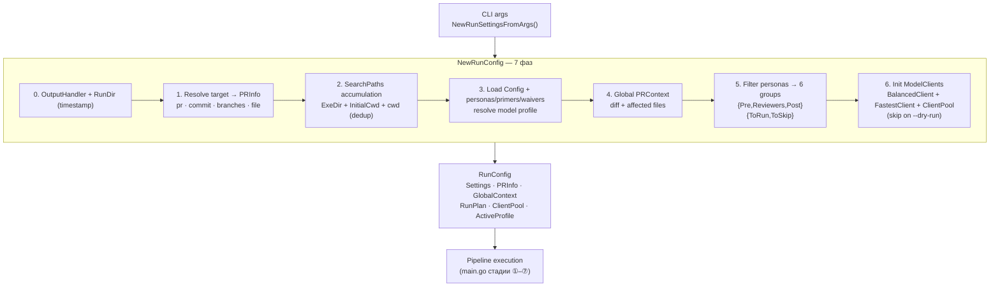

# Composition Root — NewRunConfig

> **Суть:** `NewRunConfig` (`settings.go:345`) — единственное место сборки всех
> зависимостей (composition root). Сегодня он же делает бизнес-планирование — это
> god-method, который [[Рефакторинг к DDD-пакетам]] предлагает распилить.

## Архитектурный обзор



## Код

Реальные структуры `RunSettings` и `RunConfig` из `settings.go`:

```go
type RunSettings struct {
    Command               string
    Repo                  string
    PRNumber              string
    CommitHash            string
    CompareTo             string
    FilePatterns          []string
    MaxTokens             *int
    Concurrency           int
    ModelProfile          string
    InitialCwd            string
    ExeDir                string
    DryRun                bool
    ContextEval           bool
    ContextEvalCSV        string
    IncludePersonas       []string
    ExcludePersonas       []string
    ExcludePostExplainers bool
    PromptOnly            bool

    // Context Primers
    ContextFormat    string
    PlannedFiles     []string
    PlannedFunctions []string
    PlannedConcepts  []string
}

type RunPlan struct {
    PreRunToRun     []PersonaRun
    PreRunToSkip    []PersonaRun
    ReviewersToRun  []PersonaRun
    ReviewersToSkip []PersonaRun
    PostRunToRun    []PersonaRun
    PostRunToSkip   []PersonaRun
}

type RunConfig struct {
    Settings      *RunSettings
    Config        *Config
    Personas      []Persona
    Primers       []Primer
    Waivers       []Waiver
    PRInfo        *PRInfo
    GlobalContext *PRContext
    RunDir        string
    SearchPaths   []string

    RunPlan

    BalancedClient ModelClient
    FastestClient  ModelClient
    ClientPool     *ClientPool
    OutputHandler  *OutputHandler
    ActiveProfile  string
}
```

Начало `NewRunConfig` — инициализация и разрешение цели (`settings.go:356`):

```go
func NewRunConfig(ctx context.Context, s *RunSettings) (*RunConfig, error) {
    rc := &RunConfig{
        Settings: s,
    }

    // 0. Initialize OutputHandler early
    rc.RunDir = s.RunDir()
    logDir := filepath.Join(s.InitialCwd, ".ai-review", s.Repo)
    rc.OutputHandler = NewOutputHandler(rc.RunDir, logDir)

    // 1. Resolve target info
    if s.IsFile() {
        if err := EnsureRepo(s.Repo); err != nil { ... }
        rc.PRInfo, err = GetFileInfo(s.Repo, s.CommitHash, s.FilePatterns)
    } else if s.IsCommit() {
        if err := FetchCommit(s.Repo, s.CommitHash); err != nil { ... }
        rc.PRInfo, err = GetCommitInfo(s.CommitHash, s.CompareTo)
    } else if s.IsBranches() {
        rc.PRInfo, err = GetBranchesInfo(s.Repo, s.CompareTo, s.CommitHash)
    } else { // PR mode
        rc.PRInfo, err = GetPRInfo(s.Repo, s.PRNumber)
    }
    // ... фазы 2–6
}
```

## Семь фаз
1. **Вывод** — `OutputHandler`, `RunDir` по таймстампу.
2. **Разрешение цели → [[PRContext — ревьюируемый мир|PRInfo]]** — ветвление
   `pr`/`commit`/`branches`/`file`; `EnsureRepo`, `FetchRefs` (`git.go`).
3. **SearchPaths** — ExeDir, InitialCwd, cwd; дедуп с сохранением порядка.
4. **Загрузка артефактов и конфига** — персоны/праймеры/вейверы + резолв профиля моделей.
   См. [[Обнаружение артефактов — 3 слоя]], [[Model Category и Profile — позднее связывание]].
5. **Глобальный [[PRContext — ревьюируемый мир|PRContext]]** — дифф + затронутые файлы.
6. **Фильтрация персон в 6 групп** `{Pre,Reviewers,Post}{ToRun,ToSkip}` — каждая
   получает *суженный* контекст. Логика — [[FilterSet — управление стоимостью]].
7. **Клиенты моделей** (двухуровневые: `BalancedClient` + `FastestClient`); при
   `--dry-run` пропускается.

## CLI как явная Target Spec
`RunSettings` (`settings.go:215`) + подкоманды `pr`/`commit`/`branches`/`file` и
`context`/`concepts`. Парсер допускает **interspersed-флаги** (до/после позиционных,
`settings.go:1001`) — нетипично для стандартного `flag` Go.

## Режимы наблюдаемости без затрат
- `--dry-run` — только скан, без вызовов моделей.
- `--context-eval` — посчитать размеры контекста/токены (+ CSV); питается
  токен-бюджетом из [[Конструктор промптов — порядок и бюджет]].
- `--prompt-only` — построить промпты и остановиться. **Нюанс:** pre-explainer'ы
  при этом **всё равно исполняются** (`persona.go:115`), т.к. от их JSON-вывода
  зависят промпты ревьюеров; пропускаются только сами ревьюеры/post.

Это позволяет отлаживать и оценивать стоимость **до** траты денег.
Тест этих режимов: [[Fixture dry-run — тест фильтрации без токенов]].

## Долг (см. рефакторинг)
`NewRunConfig` совмещает **wiring** и **оркестрацию**. Предложение: `infra`-конструкторы +
`app.Planner` (фаза 6) + `app.RunService` (стадии конвейера) + тонкий `cmd/main`.
Подробно: [[Рефакторинг к DDD-пакетам]].

## Связи
- Что исполняется после: [[Sequence — конвейер ревью]].
- Карта слоёв: [[Контекстная карта — Bounded Contexts]].
