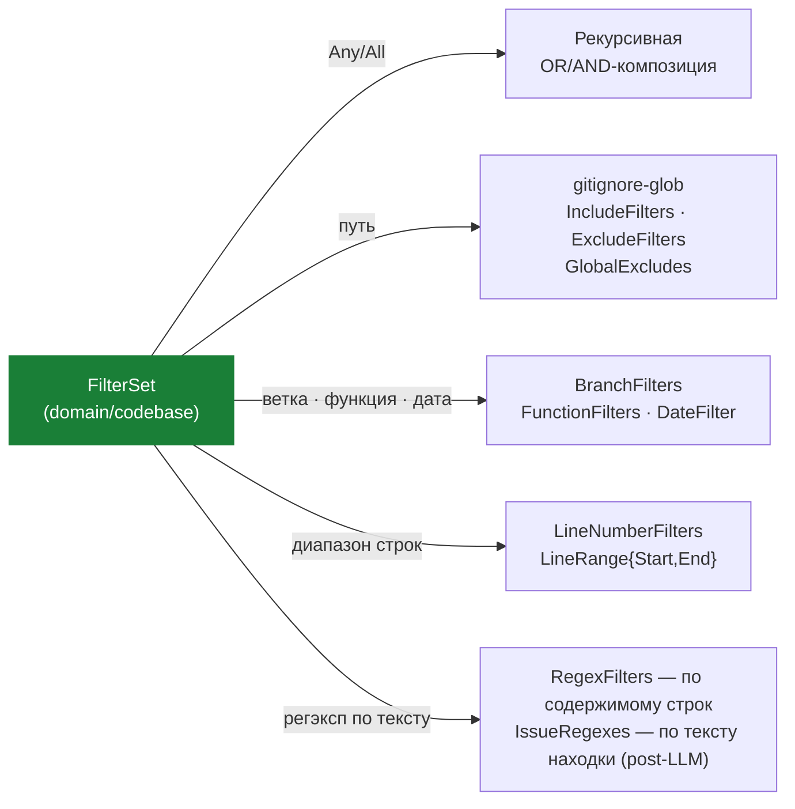

# FilterSet — управление стоимостью

> **Суть:** `FilterSet` — Value Object-предикат «релевантен ли файл/находка данной
> персоне/праймеру/вейверу». Это **главный рычаг экономики**: токены тратятся только
> на доказанно релевантном (первопринцип из [[MOC — ai-reviewer]]).

## Архитектурный обзор



> Порядок проверки: дёшево → дорого. Файл отбрасывается раньше, чем его дифф попадёт в промпт.

## Код

Реальное определение из `internal/domain/codebase/codebase.go`:

```go
type FilterSet struct {
    IncludeFilters    []string         `yaml:"path_filters"`
    ExcludeFilters    []string         `yaml:"exclude_filters"`
    GlobalExcludes    []string         `yaml:"-"` // Passed from Config
    RegexFilters      []*regexp.Regexp `yaml:"-"`
    RawRegexFilters   []string         `yaml:"regex_filters"`
    BranchFilters     []string         `yaml:"branch_filters"`
    FunctionFilters   []string         `yaml:"function_filters"`
    LineNumberFilters []LineRange      `yaml:"line_numbers_filter"`
    DateFilter        string           `yaml:"date_filter"`
    IssueRegexes      []string         `yaml:"issue_regexes"`
    IssueRegexObjects []*regexp.Regexp `yaml:"-"`

    Any []FilterSet `yaml:"any,omitempty"`
    All []FilterSet `yaml:"all,omitempty"`
}
```

Метод `Matches` — порядок проверок с короткими замыканиями:

```go
func (fs *FilterSet) Matches(opts MatchOptions) bool {
    if len(fs.Any) > 0 {
        for _, sub := range fs.Any {
            if sub.Matches(opts) {
                return true
            }
        }
        return false
    }

    if len(fs.All) > 0 {
        for _, sub := range fs.All {
            if !sub.Matches(opts) {
                return false
            }
        }
        return true
    }

    if !fs.MatchesPath(opts.Filename) {
        return false
    }

    if len(fs.BranchFilters) > 0 {
        if !PathIncluded(opts.Branch, fs.BranchFilters, true) {
            return false
        }
    }

    if len(fs.FunctionFilters) > 0 { /* ... точное совпадение имён функций */ }

    if fs.DateFilter != "" && !opts.CommitDate.IsZero() { /* ... */ }

    if len(fs.LineNumberFilters) > 0 { /* ... line >= r.Start && line <= r.End */ }

    if len(fs.IssueRegexObjects) > 0 { /* ... по FindingSummary/FindingDetails */ }

    // Последнее — самое дорогое: регэксп по содержимому строк
    if len(fs.RegexFilters) == 0 {
        return true
    }
    for _, line := range opts.ChangedLines {
        for _, re := range fs.RegexFilters {
            if re.MatchString(line) {
                return true
            }
        }
    }
    return false
}
```

`GlobalExcludes` с override — lock-файлы выкидываются, кроме явного Include:

```go
func (fs *FilterSet) MatchesPath(path string) bool {
    // ...
    if len(fs.GlobalExcludes) > 0 {
        // Global excludes are applied UNLESS explicitly included
        if PathIncluded(path, fs.GlobalExcludes, false) && !PathIncluded(path, fs.IncludeFilters, false) {
            return false
        }
    }
    return true
}
```

## Структура (`context.go:44`)
```go
type FilterSet struct {
    IncludeFilters    []string         // gitignore-стиль
    ExcludeFilters    []string
    GlobalExcludes    []string         // из Config, если не перекрыто Include
    RegexFilters      []*regexp.Regexp // по содержимому изменённых строк
    BranchFilters     []string
    FunctionFilters   []string         // точное совпадение имён функций
    LineNumberFilters []LineRange      // диапазоны строк (включительно)
    DateFilter        string           // "2006-01-02": коммиты строго до даты
    IssueRegexes      []string         // по тексту находки (post-LLM)
    Any  []FilterSet                   // OR-композиция
    All  []FilterSet                   // AND-композиция
}
```

## Идея 1 — двухслойная фильтрация (порядок дёшево→дорого)
`Matches()` (`context.go:85`) с короткими замыканиями:
```
Any/All → путь → ветка → функция → дата → диапазон строк → регэксп находки → регэксп содержимого
```
**Файл отбрасывается раньше, чем его дифф попадёт в промпт.** Самый сильный приём:
исключить пути *до* выборки диффа + регэксп по содержимому → убирает ~95% объёма
без единого обращения к LLM.

## Идея 2 — композитные `Any`/`All`
Рекурсивная композиция = вложенная булева логика = маленький **DSL предикатов данными**,
а не кодом.

## Идея 3 — `global_excludes` с override
Lock-файлы, `go.sum`, сгенерированное — выкидываются всегда, **кроме** явного `Include`
(`context.go:662`). Свежий коммит `038ecd4` добавил сюда `config.yaml`, чтобы такие файлы
«не съедали токены».

## Где используется
Один и тот же VO питает фильтрацию **персон**, **праймеров** и **вейверов** — единый
механизм релевантности через всю систему.

## Связи
- Питает: [[Persona — корень агрегата ревью]], [[Primer и Concept — инъекция знания]],
  [[Waiver — LLM-судья подавления]].
- Над чем работает: [[PRContext — ревьюируемый мир]] (`FileContext.Matches`).
- Применяется при планировании: [[Composition Root — NewRunConfig]].
