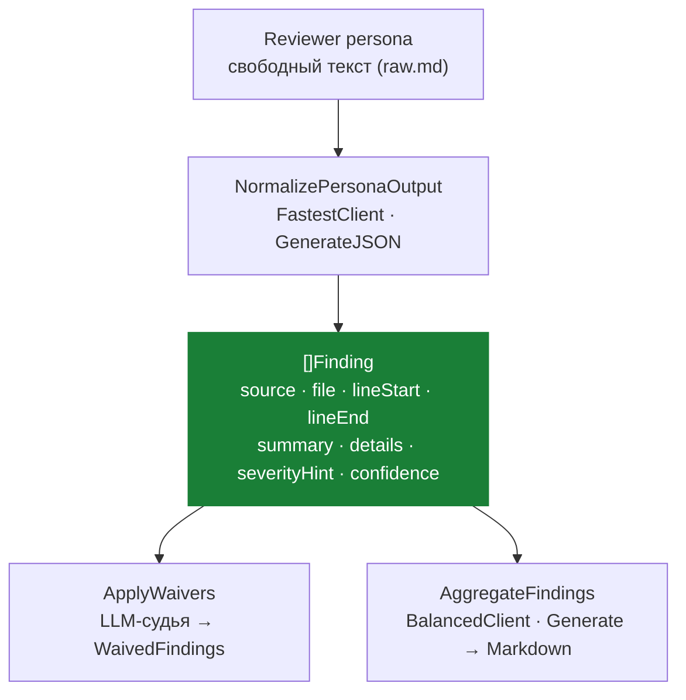

# Finding — Value Object находки

> **Суть:** атом результата ревью. Главная идея вокруг него — **«сырой текст → отдельная
> дешёвая нормализация в JSON»**: ревьюер творит свободно, дисциплину наводит другой шаг.

## Архитектурный обзор



## Код

Реальное определение из `internal/domain/review/review.go`:

```go
type Finding struct {
    Source       string  `json:"source"`
    File         string  `json:"file"`
    LineStart    *int    `json:"line_start,omitempty"`
    LineEnd      *int    `json:"line_end,omitempty"`
    Summary      string  `json:"summary"`
    Details      string  `json:"details,omitempty"`
    SeverityHint string  `json:"severity_hint"` // low | medium | high | critical | unknown
    Confidence   float64 `json:"confidence"`    // 0.0–1.0
}
```

`NormalizePersonaOutput` из того же файла — разделение «поиск» vs «структуризация»:

```go
func NormalizePersonaOutput(ctx context.Context, client ModelClient, personaID, rawOutput string) ([]Finding, ModelResult, error) {
    prompt := fmt.Sprintf("%s\n\n--- PERSONA OUTPUT (%s) ---\n%s", NormalizationSystemPrompt, personaID, rawOutput)

    normCtx, cancel := context.WithTimeout(ctx, 5*time.Minute)
    defer cancel()

    result, err := client.GenerateJSON(normCtx, prompt, 0)
    if err != nil {
        return nil, ModelResult{}, err
    }

    text := ExtractJSON(result.Text)

    var response NormalizationResponse
    if err := json.Unmarshal([]byte(text), &response); err != nil {
        return nil, result, fmt.Errorf("error unmarshaling normalization response: %w", err)
    }

    return response.Findings, result, nil
}
```

`AggregateFindings` — финальная сборка, при 0 находках LLM не вызывается:

```go
func AggregateFindings(ctx context.Context, client ModelClient, findings []Finding) (string, ModelResult, error) {
    if len(findings) == 0 {
        return "## Summary\nNo issues found by any persona.", ModelResult{}, nil
    }
    // ... marshal findings → prompt → client.Generate → Markdown report
}
```

## Структура (`pipeline.go:11`)
```go
type Finding struct {
    Source       string  // ID персоны-автора → атрибуция!
    File         string
    LineStart    *int
    LineEnd      *int
    Summary      string
    Details      string
    SeverityHint string  // low | medium | high | critical | unknown
    Confidence   float64 // 0.0–1.0
}
```
`Source` связывает находку с [[Persona — корень агрегата ревью|персоной]] — язык домена
не теряется между слоями (принцип DDD).

## Идея: разделение «поиск» vs «структуризация»
1. [[Persona — корень агрегата ревью|Reviewer]] пишет **свободный текст** (творческая часть).
2. **Отдельный дешёвый клиент `rc.FastestClient`** нормализует его в строгий JSON
   (`NormalizePersonaOutput`, `pipeline.go:186`; вызов `persona.go:194`). Нормализация
   логируется **отдельной** записью `normalization:<id>` со своей ценой (две записи на ревьюера).
3. Системный промпт нормализатора (`pipeline.go:55`) жёстко **запрещает**: выдумывать
   находки, заново анализировать код, **угадывать номера строк**.

Почему хорошо: это разные задачи и разные модели. Дисциплина не мешает поиску.

## Устойчивость
- `extractJSON` (`pipeline.go:171`) терпим к ```-ограждениям (```json и просто ```).
- Сбой парсинга → **«ноль находок»**, а не падение конвейера.

## Агрегация (финальная стадия ⑤)
`AggregateFindings` (`pipeline.go:216`) одной моделью (`balanced`, фолбэк `best_code`)
через `Generate` (**свободный Markdown, не JSON**): dedup → кластеризация → презентационная
severity → **сохранение атрибуции** `@persona{ID}` → секции *Must Fix / Major / Review
Carefully / Consider / Persona Summaries*.
- При **0 находок** модель не вызывается вовсе — возвращается готовый
  `"## Summary\nNo issues found"` (`pipeline.go:217`).
- Правило severity: **upgrade при согласии нескольких персон**, downgrade при низком
  `confidence` (`pipeline.go:164-165`). Передаётся в [[Agent Handoff — скептический второй агент]].

## Связи
- Кто производит: [[Persona — корень агрегата ревью]].
- Кто подавляет: [[Waiver — LLM-судья подавления]] (дописывает `[Waived by..]` в `Details`).
- Где в потоке: [[Sequence — конвейер ревью]] стадии ③ и ⑤.
- Какая модель: [[Model Category и Profile — позднее связывание]].
