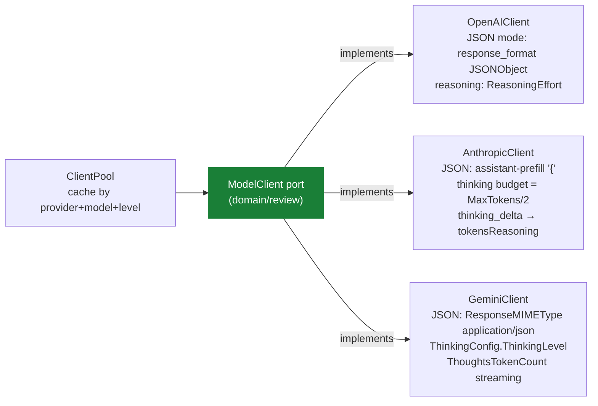

# Model Access — ACL над провайдерами

> **Суть:** узкий интерфейс `ModelClient` изолирует домен от провайдеров. В терминах
> DDD это **Anti-Corruption Layer**: домен ничего не знает про API Anthropic/OpenAI/Gemini.

## Архитектурный обзор



## Таблица провайдеров (из `models.go`)

| Провайдер | JSON-режим | Reasoning | Особенности |
|---|---|---|---|
| **OpenAI** | `response_format: JSONObject` | `ReasoningEffort` (low/medium/high) | Стандартный streaming через `CreateChatCompletion` |
| **Anthropic** | assistant-prefill `"{"` (несовместим с thinking) | thinking budget = `MaxTokens/2`, мин. 1024 | Стриминг событий; thinking_delta → estimate `chars/4`; `MaxTokens` авто-расширяется выше budget |
| **Gemini** | `ResponseMIMEType: "application/json"` | `ThinkingConfig.ThinkingLevel` (low/medium/high) | `ThoughtsTokenCount` из `UsageMetadata`; `IncludeThoughts: false` |

## Код

Реальный `ModelClient` port из `internal/domain/review/review.go`:

```go
// ModelClient is the port the domain uses to talk to any LLM provider.
// infra/modelclient adapters (OpenAI/Anthropic/Gemini) implement it.
type ModelClient interface {
    Generate(ctx context.Context, prompt string, maxTokens int) (ModelResult, error)
    GenerateJSON(ctx context.Context, prompt string, maxTokens int) (ModelResult, error)
}
```

Антропик thinking budget — авто-расширение `max_tokens` (`models.go`):

```go
if c.reasoningLevel != "" && c.reasoningLevel != "none" {
    budget := int64(2048)
    if params.MaxTokens > 4096 {
        budget = int64(params.MaxTokens / 2)
    } else if params.MaxTokens <= 2048 {
        if params.MaxTokens > 1024 {
            budget = 1024
        } else {
            budget = 0
        }
    }

    if budget >= 1024 {
        params.Thinking = anthropic.ThinkingConfigParamOfEnabled(budget)
        if params.MaxTokens <= budget {
            params.MaxTokens = budget + 1024  // обязан быть больше бюджета
        }
        usingThinking = true
    }
}

// assistant-prefill: несовместим с extended thinking
if jsonMode && !usingThinking {
    params.Messages = append(params.Messages,
        anthropic.NewAssistantMessage(anthropic.NewTextBlock("{")))
}
```

Gemini ThoughtsTokenCount (реальное поле SDK):

```go
if resp.UsageMetadata != nil {
    tokensIn = int(resp.UsageMetadata.PromptTokenCount)
    tokensOut = int(resp.UsageMetadata.CandidatesTokenCount)
    tokensReasoning = int(resp.UsageMetadata.ThoughtsTokenCount)
}
```

## Интерфейс (`models.go:46`)
```go
type ModelClient interface {
    Generate(ctx, prompt string, maxTokens int) (ModelResult, error)      // свободный текст
    GenerateJSON(ctx, prompt string, maxTokens int) (ModelResult, error)  // строгий JSON
}
```
`ModelResult` несёт `Text` + учёт токенов (`TokensIn/Out/Reasoning`) + `FinishReason`.
Фабрика `GetModelClient` (`models.go:360`) выбирает реализацию по строке провайдера; ключи
из `KEYS.env`, затем из окружения.

## Идея — нормализация «reasoning/thinking»
Категория несёт `reasoning_level` (`none/low/medium/high`), ACL транслирует в провайдер-специфику:
- **OpenAI** — `ReasoningEffort`.
- **Anthropic** — расчёт **thinking budget** (мин. 1024, до половины `max_tokens`,
  c авто-расширением `max_tokens`, т.к. он обязан быть больше бюджета, `models.go:192`).
  Глубокий разбор + 2 подвоха: [[Anthropic-стриминг и thinking budget]].
- **Gemini** — `ThinkingLevel`.

Домен про это не знает — это и есть суть ACL.

## Идея — стоимость как first-class
Цена считается прямо из учёта токенов:
```
(in·in_price + (out+reasoning)·out_price) / 1e6        // main.go:341
```
Reasoning-токены тарифицируются по выходной цене. Итог агрегируется по моделям → в отчёт
и `run-log.jsonl`.

## Это и есть port для рефакторинга
В [[Рефакторинг к DDD-пакетам]] `ModelClient` выносится в `domain/review` как **port**,
а `infra/modelclient` его **реализует**. Так инверсия зависимостей становится честной.

## Связи
- Кто задаёт категорию/reasoning: [[Model Category и Profile — позднее связывание]].
- Кто вызывает: [[Persona — корень агрегата ревью]], [[Waiver — LLM-судья подавления]],
  [[Finding — Value Object находки|normalize/aggregate]].
- Куда выносим: [[Рефакторинг к DDD-пакетам]].
