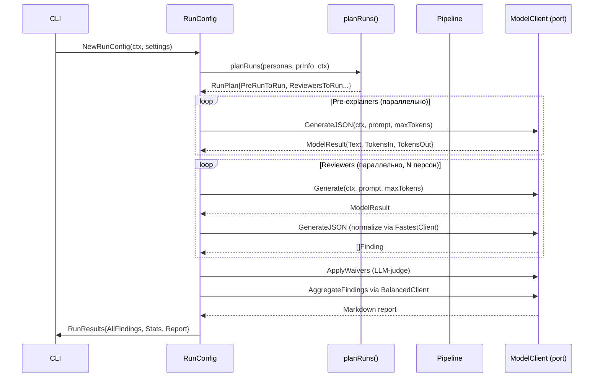
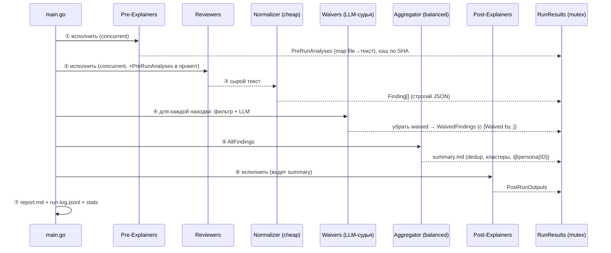

# Sequence — конвейер ревью

> **Суть:** ревью — это **упорядоченный** 7-стадийный конвейер (зависимости по данным),
> но **внутри стадии** персоны исполняются конкурентно (семафор на `Concurrency`,
> по умолчанию 5, `main.go:144`). Это и есть «оркестрация» из [[MOC — ai-reviewer|девиза]].

## Архитектурный обзор



## Стадии (горизонтально)

```
 ①              ②             ③           ④           ⑤            ⑥           ⑦
pre-       ─▶ reviewers  ─▶ normalize ─▶ waivers  ─▶ aggregate ─▶ post-    ─▶ report
explainers    (concurrent)  (cheap LLM)  (LLM-судья)  (balanced)   explainers
JSON,кэш SHA  raw text      Finding[]    -waived      Markdown     Markdown   stdout+
                                                      summary                 артефакты
```

## Sequence (mermaid)



## Поток данных (через `RunResults`, защищён мьютексами)
1. **① → ②**: `PreRunAnalyses` подмешивается выборочно (`IncludeExplainers`).
2. **② → ③ → ⑤**: сырой текст → `[]Finding` → `AllFindings`. См. [[Finding — Value Object находки]].
3. **④**: [[Waiver — LLM-судья подавления|вейверы]] переносят подавленное в `WaivedFindings`.
4. **⑤**: [[Finding — Value Object находки|агрегация]] сохраняет атрибуцию `@persona{ID}`.

## Ключевые идеи стадий
- **Разная «дороговизна модели» по стадиям** → токены по ценности шага. Поиск — категория
  персоны; normalize — дёшево; waivers — `fastest_good`; aggregate — `balanced`.
  См. [[Model Category и Profile — позднее связывание]].
- **③ Сырой текст → отдельная нормализация** разделяет «поиск» и «структуризацию».
  Подробно: [[Finding — Value Object находки]].
- **Устойчивость к сбоям**: падение персоны логируется, но **не останавливает** конвейер
  (`main.go:156`); ошибка агрегации → дефолтный summary. Отчёт выдаётся всегда.

## Связи
- Кто что исполняет: [[Контекстная карта — Bounded Contexts]].
- Точка сборки: [[Composition Root — NewRunConfig]] делит персоны на 6 групп
  `{Pre,Reviewers,Post}{ToRun,ToSkip}` до запуска.
