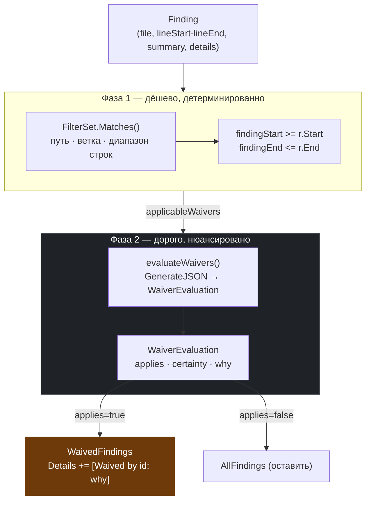

# Waiver — LLM-судья подавления

> **Суть:** вейвер — это **Policy** (декларация «этот класс проблем здесь намеренно
> допустим»). Ключевая идея — **двухфазное подавление: дешёвый фильтр + LLM-судья**,
> что избегает хрупкости чистого регэкспа.

## Архитектурный обзор



## Код

Реальные структуры из `waiver.go`:

```go
type Waiver struct {
    ID            string    `yaml:"id"`
    AIReview      string    `yaml:"ai_review"`
    ModelCategory string    `yaml:"model_category"`
    Filters       FilterSet `yaml:",inline"`
    Instructions  string
}

type WaiverEvaluation struct {
    Applies   bool    `json:"applies"`
    Certainty float64 `json:"certainty"`
    Why       string  `json:"why"`
}
```

Двухфазная логика из `ApplyWaivers` (`waiver.go:51`):

```go
func ApplyWaivers(ctx context.Context, rc *RunConfig, rr *RunResults) {
    // ...
    for _, finding := range rr.AllFindings {
        // 1. Filter waivers based on location
        for _, w := range rc.Waivers {
            if fileCtx.Matches(FileMatchOptions{FilterSet: &fs, ...}) {
                // Also check line numbers if specified
                if findingStart >= r.Start && findingEnd <= r.End {
                    applicableWaivers = append(applicableWaivers, w)
                }
            }
        }

        if len(applicableWaivers) > 0 {
            // 2. Use LLM to confirm if waiver applies
            confirmedWaiver, evaluation, err := evaluateWaivers(ctx, rc, finding, applicableWaivers)
            if err == nil && evaluation.Applies {
                finding.Details = fmt.Sprintf("%s\n\n[Waived by %s: %s]",
                    finding.Details, confirmedWaiver.ID, evaluation.Why)
                rr.WaivedFindings = append(rr.WaivedFindings, finding)
                waived = true
            }
        }
    }
}
```

## Структура (`waiver.go:15`)
```go
type Waiver struct {
    ID, ModelCategory string
    Filters           FilterSet  // см. [[FilterSet — управление стоимостью]]
    Instructions      string     // обоснование «почему игнорируем»
}
```

## Две фазы (`ApplyWaivers`, `waiver.go:54`)
**Фаза 1 — дёшево, детерминированно (локационный фильтр).**
Находка должна попасть в файл/ветку вейвера, а её диапазон строк — **полностью
содержаться** в диапазоне вейвера:
```go
findingStart >= r.Start && findingEnd <= r.End   // waiver.go:107
```

**Фаза 2 — дорого, нюансировано (LLM-судья).**
Модель получает дифф + контекст [[Finding — Value Object находки|находки]] + текст вейвера
и возвращает:
```go
type WaiverEvaluation struct {        // waiver.go:28
    Applies   bool
    Certainty float64
    Why       string
}
```

## Аудит сохраняется
Подавленная находка **не исчезает**: переносится в `WaivedFindings`, а её `Details`
дописывается строкой `[Waived by <id>: <why>]`. Paper trail (см.
[[20 переносимых идей ai-reviewer]], идея об observability).

## Живой пример (`gonka/waivers/default_params.md`)
> «Default parameters can use `DecimalFromFloat` without consensus risk. These values are
> purely for tests, as the chain is live and will not use these default values.»

Это знание **домена**, которое регэксп не выразит — потому судит LLM.

## Связи
- Что подавляет: [[Finding — Value Object находки]].
- Где в потоке: [[Sequence — конвейер ревью]] стадия ④.
- Чем матчится фаза 1: [[FilterSet — управление стоимостью]].
- Какая модель судит: [[Model Category и Profile — позднее связывание]] (обычно `fastest_good`).
