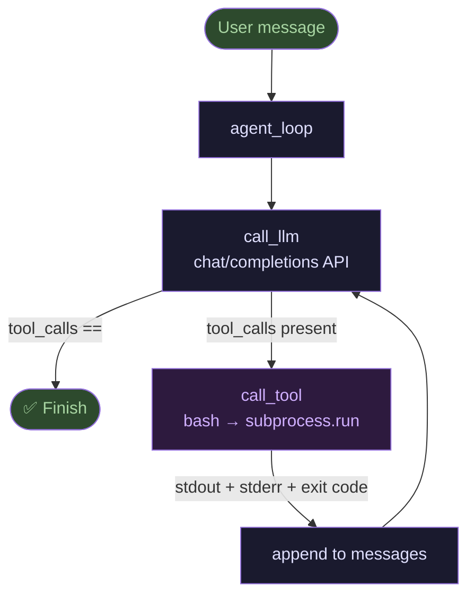

# chebupelka — минимальный coding agent

> **Суть:** 99 строк Python, одна зависимость (`requests`), один инструмент (`bash`) —
> и этого достаточно для полноценного agentic loop. Любой OpenAI-compatible сервер.

## 🎯 Одно предложение

`chebupelka` доказывает, что **ядро coding agent'а — это просто цикл**:
спросить LLM → выполнить tool call → вернуть результат → повторить.

---

## Архитектурный обзор



**Ключевой инвариант:** агент останавливается *сам* — когда LLM перестаёт вызывать
инструменты. Нет явного «стоп-слова», нет таймаута на уровне логики — только
отсутствие `tool_calls` в ответе.

---

## Разбор кода

### 1. Единственный инструмент — bash

```python
LLM_TOOLS = [{
    "type": "function",
    "function": {
        "name": "bash",
        "description": "Execute a shell command and return the output.",
        "parameters": {
            "type": "object",
            "properties": {
                "command": {"type": "string"}
            },
            "required": ["command"]
        }
    }
}]
```

Один инструмент покрывает всё: чтение файлов (`cat`), запись (`tee`), поиск (`grep`),
запуск тестов, git. Это правило «наименьшей необходимости».

### 2. Запуск с возвратом exit code и stderr

```python
def run_bash(command: str) -> str:
    result = subprocess.run(command, shell=True, capture_output=True,
                            text=True, timeout=120)
    out = result.stdout
    if result.stderr:
        out += f"\nSTDERR:\n{result.stderr}"
    return f"Exit code: {result.returncode}\n{out}"
```

**Почему `exit code` важен:** модель использует его как сигнал успеха/ошибки.
Без него `make build` вернёт пустой stdout при ошибке компиляции и агент «не поймёт».

### 3. Цикл агента (полностью)

```python
def agent_loop(user_message: str) -> None:
    messages = [
        {"role": "system", "content": SYSTEM_PROMPT},
        {"role": "user",   "content": user_message}
    ]
    for turn in range(1, MAX_TURNS + 1):
        content, tool_calls = call_llm(messages)

        if not tool_calls:           # ← точка выхода
            return

        for tool_call in tool_calls:
            result = call_tool(tool_call["function"]["name"],
                               json.loads(tool_call["function"]["arguments"]))
            # assistant turn с tool_calls обязателен перед tool turn
            messages.append({"role": "assistant", "content": content or None,
                              "tool_calls": [tool_call]})
            messages.append({"role": "tool",
                             "tool_call_id": tool_call["id"],
                             "content": result})
```

**Критический порядок:** сначала `assistant` с `tool_calls`, затем `tool` с результатом.
OpenAI API требует именно такой паттерн — нарушение → 422.

### 4. Минимальный вызов LLM

```python
def call_llm(messages):
    payload = {
        "model": LLM_MODEL,
        "messages": messages,
        "tools": LLM_TOOLS,
        "tool_choice": "auto",   # ← модель сама решает
        "temperature": 0.1,
        "max_tokens": 4096
    }
    resp = requests.post(f"{LLM_BASE_URL}/chat/completions",
                         json=payload, headers=LLM_HEADERS)
    msg = resp.json()["choices"][0]["message"]
    return msg.get("content", "").strip(), msg.get("tool_calls") or []
```

`temperature: 0.1` — почти детерминированный агент. Для кодирования это правильно.

---

## Что переносимо в свой инструмент

| # | Идея | Почему работает |
|---|------|-----------------|
| 1 | **Один инструмент `bash`** | bash = универсальный интерфейс к ОС; добавляй новые инструменты постепенно |
| 2 | **`exit code` в результате** | модель понимает успех/провал команды без парсинга stdout |
| 3 | **`tool_choice: "auto"`** | агент сам решает когда остановиться, без явного stop-signal |
| 4 | **Плоский `messages: list`** | вся история в одном списке — достаточно для большинства задач |
| 5 | **Только `requests`** | никаких SDK — работает с Ollama/vLLM/LM Studio/любым совместимым API |
| 6 | **`MAX_TURNS` как backstop** | защита от бесконечного цикла при ошибке модели |

---

## Сравнение с ai-reviewer

```
                chebupelka          ai-reviewer
Инструменты:    bash (1)            30+ (Read/Edit/Write/Grep/…)
Язык:           Python 99 строк     Go ~3000 строк
Цикл:           agent_loop()        Sequence → 7 стадий
Контекст:       плоский list        PRContext + FileContext + аннотации
Стоп:           нет tool_calls      persona отвечает без tool call
История:        без сжатия          без сжатия (оба)
Стоимость:      0 доп. зависимостей SDK: anthropic/openai/genai
Цель:           обучение/хакинг     production code review
```

**Общее ядро:** оба — agentic loop с tool calling. Разница в том, что `ai-reviewer`
кодирует всю *доменную логику ревью* (персоны, вейверы, фильтры, нормализация) поверх
того же паттерна, который `chebupelka` показывает в чистом виде.

---

## 6-строчное ядро (из видео)

Автор показывает, что вся «магия» сводится к шести строкам — это буквально весь
агентский цикл, до обвязки с print и MAX_TURNS:

```python
messages = [system_msg, user_msg]
while True:
    content, tool_calls = call_llm(messages)
    if not tool_calls:
        break                          # задача решена
    result = execute_tools(tool_calls)
    messages += [assistant_msg, tool_result_msg]
```

> *«Те, кто думал, что в Claude Code, Codex и подобных инструментах есть какая-то
> магия — теперь понимаете, что это за магия. Это шесть строк кода с агентским
> циклом. Дальше просто обвязка вокруг этого, даже без которой агент отлично
> работает.»* — Алексей Голобурдин, [видео 0:19:19](https://www.youtube.com/watch?v=H7FSTj4x4xQ)

---

## Демо из видео: реальные результаты

### Demo 1 — «Как дела?» (Turn 1)
Простой вопрос без необходимости в инструментах. Модель сразу ответила текстом
без tool_calls → агент завершился за **1 итерацию**.

### Demo 2 — Подсчёт заданий в директории курса (Turn 10)
Задача: пройти по вложенным директориям `1310/`, `1311/`, `1312/…` и посчитать
задания. Модель вызывала `ls`, `find`, `find -name`, итерировала по структуре.

```
Итераций: 10
Ответ:    482 задания (подтверждено вручную)
Команды:  ls -R | head 100 → find -mindepth 1 -type d → find -name "task.md" → …
```

### Demo 3 — FastAPI + PostgreSQL + SQLAlchemy + Alembic + pytest (Turn 85)
Полноценный продакшн-проект из одного промта:

```
Задача:    REST CRUD /users с FastAPI, SQLAlchemy async, Alembic, pytest, ruff
Итераций:  85 (при подготовке видео — 48; результат недетерминирован)
Результат: 14 тестов pytest ✅, ruff ✅, Swagger ✅, 5 REST-эндпоинтов ✅
Структура: app/main.py, routers/, schemas/, models/, db/, repositories/, services/,
           migrations/, tests/, .env, alembic.ini, README.md
```

Модель самостоятельно: установила зависимости через UV, инициализировала проект,
создала слой репозитория и сервисов, применила миграцию, прогнала ruff и pytest,
починила упавшие тесты в цикле.

### Demo 4 — «Что интересного на Хабре?» (Turn 14)
Без MCP, без специального инструмента — только bash + curl:

```
curl habr.com → 404 на RSS → нашла рабочий RSS → распарсила → 
вернула 5 свежих статей за 18.06.2026 за 14 итераций
```

**Вывод:** `bash` = `curl` = доступ в интернет. Никаких MCP-интеграций.

---

## Как расширить (из README)

```python
# Добавить инструмент read_file:

# В LLM_TOOLS добавить описание:
{"type": "function", "function": {"name": "read_file", ...}}

# В call_tool — диспетчер:
func = {"bash": run_bash, "read_file": read_file}.get(name)
```

Принцип: `call_tool` — это словарь `{name → callable}`. Добавить инструмент = добавить
запись в словарь + описание схемы для LLM.

---

## Связи
- Хаб: [[MOC — ai-reviewer]]
- Паттерн конвейера в ai-reviewer: [[Sequence — конвейер ревью]]
- Что ещё можно утащить в свой инструмент: [[20 переносимых идей ai-reviewer]]
- Параллель: [[Agent Handoff — скептический второй агент]]
- Сравнение топологий: [[Agent Loop vs Pipeline — сравнение топологий]]
