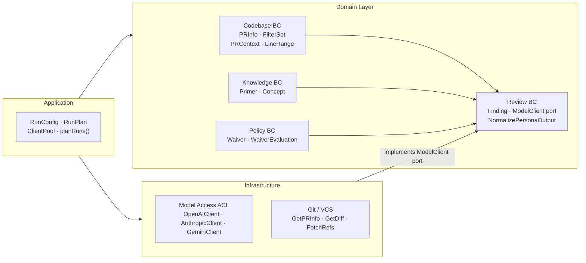
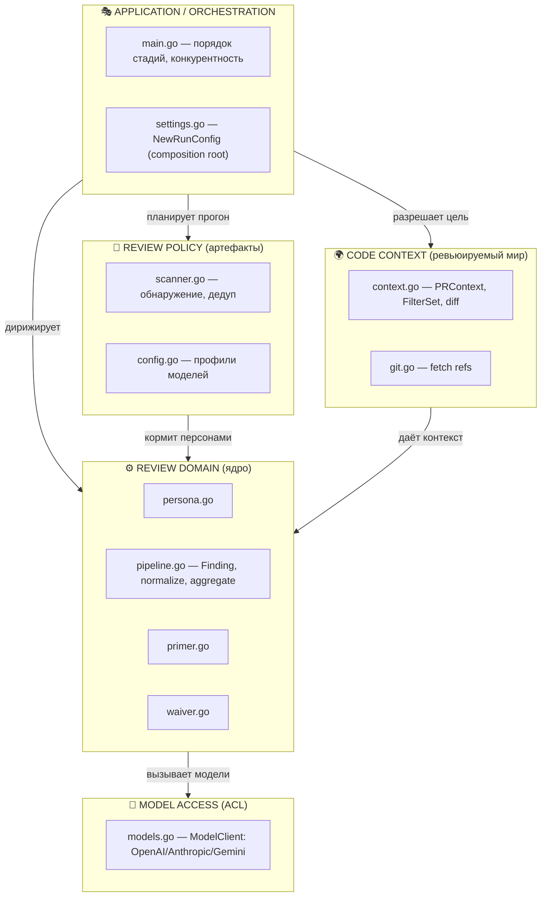

# Контекстная карта — Bounded Contexts

> **Суть:** физически код — плоский пакет `main`, но по ответственности он распадается
> на 5 чётких **bounded contexts**. Это карта *смысловых* границ, которую
> [[Рефакторинг к DDD-пакетам]] предлагает сделать физической.

## Архитектурный обзор

## Диаграмма (mermaid)

## Роли контекстов (кратко)

| Контекст | Ответственность | Ключевая заметка |
|---|---|---|
| **Review Domain** | что есть находка, как персона исполняется, normalize/waive/aggregate | [[Persona — корень агрегата ревью]] |
| **Code Context** | строит неизменяемый «мир изменений» из git | [[PRContext — ревьюируемый мир]] |
| **Review Policy** | обнаружение/загрузка артефактов и конфига | [[Обнаружение артефактов — 3 слоя]] |
| **Model Access** | изолирует провайдеров за `ModelClient` | [[Model Access — ACL над провайдерами]] |
| **Application** | CLI, планирование, оркестрация | [[Composition Root — NewRunConfig]] |

## Почему это важно (DDD)
Границы контекстов = границы, по которым язык **не должен** протекать. `Finding.Source`
ссылается на `Persona.ID`, но домен ничего не знает про API Anthropic — это держит
[[Model Access — ACL над провайдерами|ACL]]. Нарушение этих границ — главный архитектурный
долг (см. раздел «слабые стороны» в `ARCHITECTURE-DDD.md`).

## Связи
- Следующий шаг: [[Sequence — конвейер ревью]] — как контексты взаимодействуют во времени.
- Цель: [[Рефакторинг к DDD-пакетам]] — сделать эти границы физическими пакетами.
