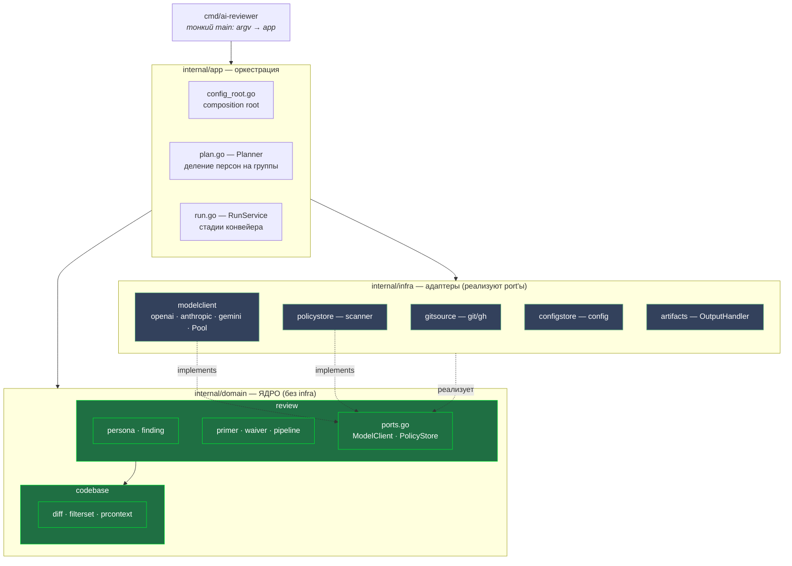
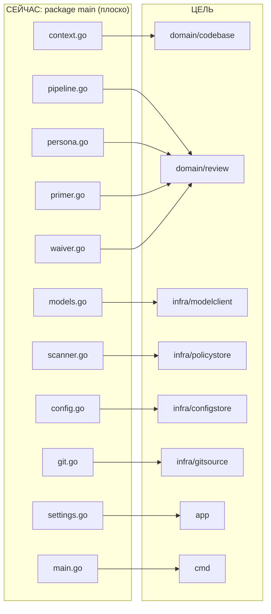
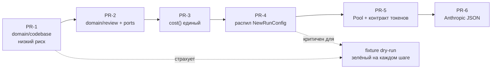

# Целевая раскладка пакетов — диаграмма

> **Суть:** визуализация цели из [[Рефакторинг к DDD-пакетам]] и
> [[PR-план рефакторинга — пошаговые diff'ы]]. Правило: стрелки зависимостей идут
> **внутрь, к домену**; `domain` не импортирует ни `app`, ни `infra`.

## Граф зависимостей (mermaid)

## Текущий плоский пакет → целевые пакеты

## Последовательность PR (порядок безопасности)

## Связи
- Текстовая раскладка: [[Рефакторинг к DDD-пакетам]].
- Шаги с diff'ами: [[PR-план рефакторинга — пошаговые diff'ы]].
- Смысловые границы: [[Контекстная карта — Bounded Contexts]].
- Страховка рефактора: [[Fixture dry-run — тест фильтрации без токенов]].
